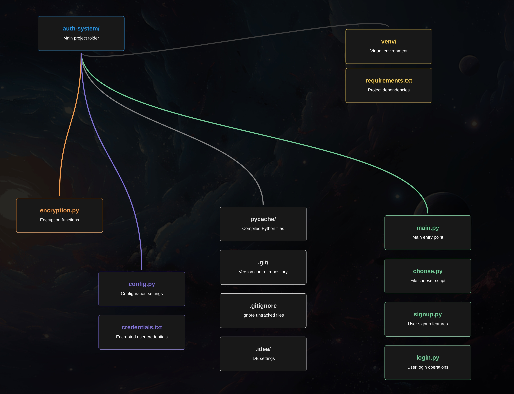

# Authentication System

## Project Overview

This is a simple authentication system built using Python. The system allows users to sign up and log in securely using email and password authentication. The project incorporates encryption and hashing techniques to protect sensitive data.

---

## Project Structure

📂 **auth-system/**  
│  
├── 📁 **Core Application Logic (Authentication & User Flow)**  
│   ├── 📄 `main.py` → Entry point of the application, directs user input.  
│   ├── 📄 `choose.py` → Guides user through signup or login selection.  
│   ├── 📄 `signup.py` → Handles user registration & email validation.  
│   ├── 📄 `login.py` → Manages user authentication.  
│  
├── 📁 **Security & Encryption**  
│   ├── 📄 `encryption.py` → Encrypts & decrypts user credentials, hashes passwords.  
│  
├── 📁 **Configuration & Data Management**  
│   ├── 📄 `config.py` → Contains file paths & cryptographic key management.  
│   ├── 📄 `credentials.txt` → Stores encrypted user credentials.  
│  
├── 📁 **Environment & Dependencies**  
│   ├── 📄 `requirements.txt` → Lists required dependencies.  
│   ├── 📁 `venv/` → Virtual environment folder.  
│  
├── 📁 **Ignored & Auto-Generated Files**  
│   ├── 📄 `.gitignore` → Specifies files ignored by Git.  
│   ├── 📁 `.git/` → Git repository metadata.  
│   ├── 📁 `.idea/` → IDE-specific settings (PyCharm).  
│   ├── 📁 `__pycache__/` → Stores compiled Python files.  


  
---

## Features

### User Signup

- Validates the email address to ensure it follows proper format.
- Validates the password to ensure it meets the complexity requirements (at least 8 characters, one uppercase letter, and one special character).
- Encrypts user data (email and password) before saving it to the file.
- Hides the credentials file to ensure data security.
  
### User Login

- Verifies the email and password by checking against the stored encrypted data.
- Provides feedback on invalid login attempts.

### Encryption & Security

- Uses **bcrypt** for hashing passwords.
- Uses **cryptography.Fernet** for encrypting and decrypting user data.
- Ensures that sensitive information like email and password is never stored in plain text.

---

## Functions Overview

- **validate_email(email)**: Validates the email format.
- **validate_password(password)**: Validates the password strength.
- **signup()**: Handles the registration process, including email and password validation, and saving encrypted data.
- **login()**: Handles the login process, including email and password verification.
- **hash_password(password)**: Hashes the password using bcrypt.
- **verify_password(password, hashed_password)**: Verifies if the provided password matches the hashed password.
- **encrypt_data(data)**: Encrypts the provided data using Fernet encryption.
- **decrypt_data(data)**: Decrypts the provided data using Fernet decryption.
- **check_email_duplicates(email)**: Checks if the provided email is already registered.

---

## How to Use

1. Clone this repository:
   ```bash
   git clone https://github.com/yourusername/auth-system.git

2. Install the dependencies:
    ```bash
    pip install -r requirements.txt

3. Run the application:
    ```bash
    python main.py

## Dependencies
This project relies on the following dependencies:
- bcrypt: Used for secure password hashing.
- cryptography.Fernet: Used for encrypting and decrypting user data.


